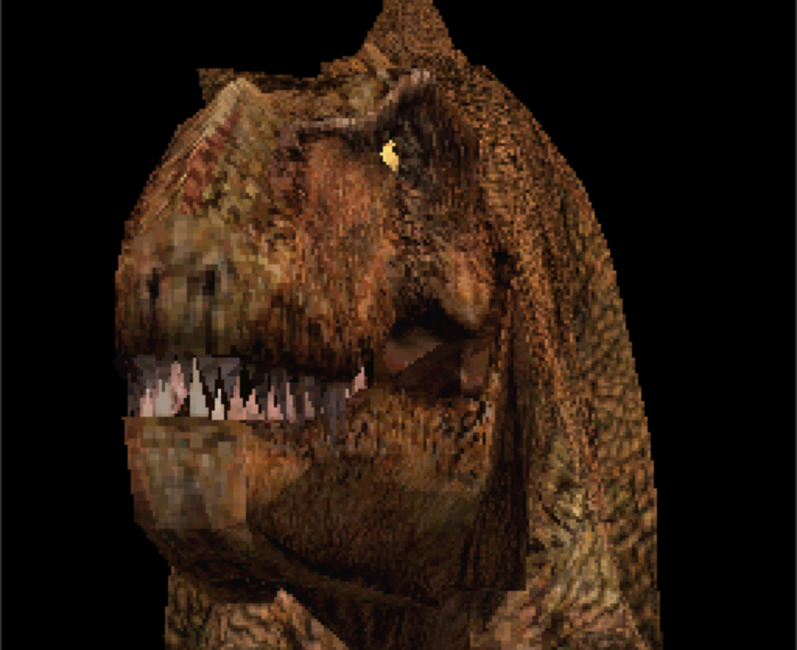

# F030TREX

An Atari Falcon030 port (16 MHz, DSP56001) of the T-Rex renderer from PS1
Demo One (SCES-00048): a DSP56001 geometry/triangle-setup core paired with
an M68030 software rasterizer, targeting a 240x224 render surface inside a
256x224 Videl mode.

## Download

Prebuilt release archives are on the
[releases page](https://github.com/AnimaInCorpore/F030TREX/releases):
`TREX.ZIP` contains `TREX.TOS`, `TREX.LOD` and the 40-column `README.TXT`,
ready to unpack and run on a stock Falcon030 or under Hatari.  The current
release is
[v1.2](https://github.com/AnimaInCorpore/F030TREX/releases/tag/v1.2) --
the full-mesh package rebuilt from the post-v1.1 DSP and M68030 sources,
with the corrected release benchmark and validation fixes included.

## Building

Requirements: `node`, a C compiler/`make` for vasm and vlink
(built from the bundled tarballs), and optionally DOSBox to rebuild the DSP
program.

`TREX/dsp/trex_dsp.lod` is checked in prebuilt; `make trex_release` needs no
DOSBox for it. Rebuilding the DSP program after a change to `trex_dsp.asm`
does:

```sh
make DOSBOX=/Applications/dosbox.app/Contents/MacOS/DOSBox trex_dsp
```

The full-mesh occlusion-culling release package is built with:

```sh
make trex_release
```

This produces `TREX/m68030/TREX.TOS`: the full 2,724-triangle model with armed
DSP occlusion, textured Gouraud lighting, and no per-frame diagnostic file
writes.  Its matching `TREX.LOD` is copied beside it for deployment, and
`TREX/m68030/README.TXT` is the 40-column, CRLF release note that ships with
them; those three files together are the release archive.

The release also draws a frame-rate readout in the top-left corner: white
`NN.NN` frames per second, fixed width so the digits never shift column.  It is
built from `-DTREX_FPS` and is on the release target only -- it writes into the
framebuffer, so the diagnostic and capture binaries deliberately omit it (see
OPTIMIZATION.md 2.6).

Run the release on a Falcon or under Hatari from the directory containing the
two files. For TOS 4.02 under Hatari:

```sh
hatari --machine falcon --tos /path/to/tos402.rom --dsp emu --memsize 4 \
  TREX.TOS
```

Use TOS 4.02, 4 MB of ST-RAM and DSP emulation enabled.

**For timing work, use the corrected Hatari, not a stock one.** Stock Hatari
(including the 2.6.1 Homebrew release) grants the Falcon DSP four clocks per
emulated 68030 clock instead of two, so the DSP56001 runs at 32 MIPS against
the real 16. The build vendored in the sibling `F030Arcade` checkout at
`third_party/hatari` fixes that and recalibrates the CPU-to-DSP host port
against DSPBench's real-Falcon figures. On this program the difference is 84.5
ms per frame — 449.7 ms / 2.22 FPS becomes 534.2 ms / 1.87 FPS, all of it in
the DSP readback and packet-build stage, with byte-identical output.
`make measure` runs the documented headless timing recipe against that build
and prints the stage report; OPTIMIZATION.md 2.4b has the measurement, the
mechanism and what it changes. Stock Hatari remains fine for simply watching
the program run. **TOS 4.04 is not
compatible with the current DSP load path**: the program reaches its
video-mode setup, but the DSP remains closed and no triangle packets are
produced. The T-Rex stays absent, although the release-only FPS field can
still update on the black framebuffer. That is a TOS/DSP startup issue, not a
rasterizer failure.

### Hatari capture



## Required reading

[AGENTS.md](AGENTS.md) and [OPTIMIZATION.md](OPTIMIZATION.md) are part of the
implementation, not optional notes: architecture, protocol formats, memory
budgets and every performance-relevant change are documented there and must
stay that way. [TREX/dsp/README.md](TREX/dsp/README.md) describes the DSP
core, its host protocol and its memory budget in detail.

Note: OPTIMIZATION.md is a running measurement log and occasionally names
analysis tooling (for example occlusion-culling or opaque-packet
self-tests) that is not part of this repository's build. Treat those
mentions as the historical record of how a figure was produced, not as
commands you can run here.

## Target and current state

Atari Falcon030, 16 MHz, DSP56001. Render target 240x224 inside a 256x224
Videl mode. The supported release is a single full-mesh package: `TREX.TOS`
uses the 2,724-triangle model, DSP occlusion, and textured Gouraud shading;
`TREX.LOD` is the matching DSP program. The deprecated reduced-mesh variant
and its build assets have been removed. Performance figures in
OPTIMIZATION.md are identified as Hatari/emulator results; physical Falcon030
timing remains unmeasured. Figures predating OPTIMIZATION.md 2.4b were taken
with the DSP at twice its real clock and are superseded by the re-measurement
there. Over the 265-frame prefix the full-mesh **diagnostic** baseline is
**534.2 ms / 1.87 FPS**, and the shipped `TREX.TOS` itself measures **536.5 ms /
1.86 FPS** — the first headless timing of the release build (OPTIMIZATION.md
2.4c), which also finds that disarming the occlusion prepass would make it
533.0 ms / 1.88 FPS.

The v1.2 release has a measured figure: **511.2 ms per frame, 1.956 FPS**
under a Hatari corrected to run the DSP at the Falcon's real clock
(OPTIMIZATION.md 2.4e). Older figures in that file were taken on a stock
emulator that ran the DSP at twice its rate and are ~24% optimistic on the
whole frame; sections 2.4b--2.4e are the corrected ones. Still not a Falcon
measurement.

The DSP program is the post-harvest build of OPTIMIZATION.md section 2.3h:
nine sites reworked for size and speed at byte-identical output, with the
armed occlusion prepass measured 25.6% cheaper in Hatari and the freed
program memory documented as the budget for future occlusion-yield work
(section 2.3i records why finer coverage cells alone were measured out and
what the actual binding constraint is).

## Feature comparison with the PS1 reference

The port preserves the source model and animation data, but its execution
pipeline is deliberately Falcon-specific. This table describes the current
release rather than claiming pixel-for-pixel equivalence with the PS1 demo.

| Feature | PS1 reference | Falcon port (`TREX.TOS`) |
| --- | --- | --- |
| Mesh | Original TMD model | Same full mesh: 1,376 vertices and 2,724 triangles |
| Animation | Authored morph-target choreography | Extracted PS1 morph data rebuilt on the DSP: 46 full gait poses plus sparse targets 5–8; the port adds a post-source hold after frame 273 |
| Transform and culling | Original console geometry pipeline | DSP56001 handles transform, perspective projection, near-plane, degenerate-area, back-face and screen culling |
| Occlusion | Reference-scene behavior | Falcon addition: an armed DSP screen-space prepass builds a conservative triangle kill bitmap during the authored choreography and the continuing post-frame-273 hold |
| Lighting | Original PS1 lighting | Textured Gouraud shading with three coloured lights and reddish ambient light; documented as not yet an exact PS1 lighting reproduction |
| Textures | PS1 TIM pages and CLUT metadata | Extracted PS1 texture pages and CLUTs, sampled by the M68030 software rasterizer |
| Rasterization | PS1 hardware GPU path | M68030 software rasterizer; the DSP supplies projected vertices and span setup, and the host links the Ordering Table |
| Display | Original PS1 display mode | 240×224 render surface inside a 256×224 Falcon Videl mode |

The release therefore matches the PS1 source data most closely in geometry,
animation and texture assets, while transform, occlusion, lighting and
rasterization are the Falcon implementation.

## Credits

The PlayStation forensics -- working out the TMD model, the TANM morph
animation and the TIM texture pages from the source disc -- the whole M68030
front end and most of the DSP56001 program were written by AI: ChatGPT 5.6,
Claude Opus 5 and Claude Fable 5.

Sascha Springer's share is the direction, a number of the ideas, and the two
innermost routines of the DSP core, both carried over from the Falcon DSP 3D
engine he wrote in 1994: `transform_vertices` is the MAC pipeline of that
engine's `rotate_translate`, unchanged apart from three added `rnd`
instructions and new symbol names, and the signed perspective divide is the
same 1994 `rep #24` / `div` sequence. They run per vertex and per visible
triangle, so the oldest code in the repository is also the hottest.
Everything beyond that is the AI's work.

Model, animation and textures are extracted from Sony's PlayStation *Demo
One* (SCES-00048). The 256x224 Videl register sets are Screenspain's
(Chris/AURA and Scandion/Mugwumps), carried over from the F030Arcade snowbros
port -- see the video-mode comment in `TREX/m68030/trex_m68030.s`. This is a
non-commercial hobby port; the original PS1 assets belong to their owners.
